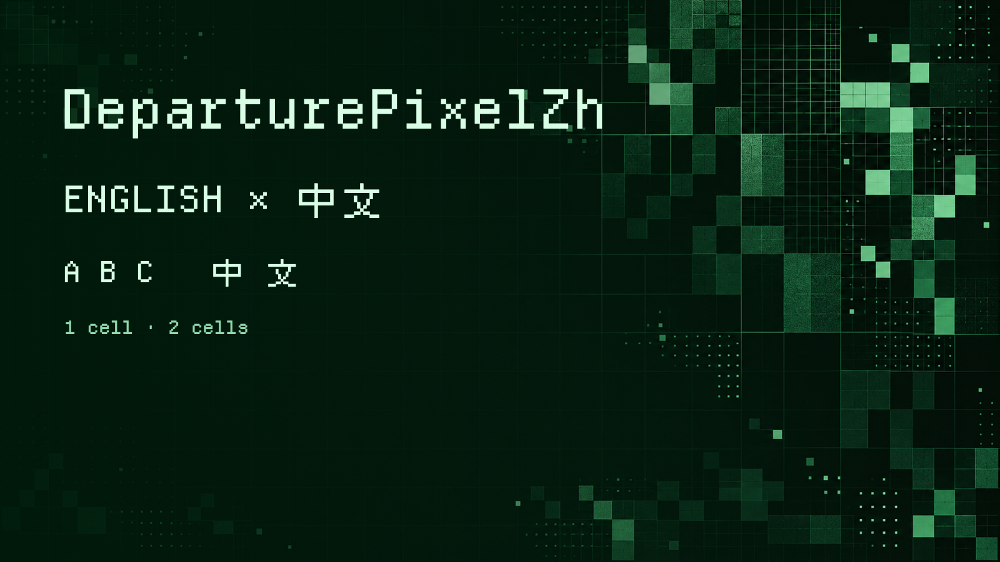

# DeparturePixelZhBuilder

[English](README.md) · [简体中文](README.zh-Hans.md) · [日本語](README.ja.md) · [한국어](README.ko.md) · [Español](README.es.md)

Genera DeparturePixelZh y DeparturePixelZh Compact a partir de una receta versionada. Combina letras inglesas, caracteres chinos de estilo píxel e iconos para desarrolladores en una fuente monoespaciada.

[Descargar fuentes DeparturePixelZh 0.1.0 (ZIP)](https://github.com/codingEzio/DeparturePixelZh/releases/download/v0.1.0/DeparturePixelZh-0.1.0.zip) · [Todas las versiones](https://github.com/codingEzio/DeparturePixelZh/releases)



## Empezar

Instala [uv](https://docs.astral.sh/uv/) y coloca el repositorio de fuentes DeparturePixelZh en un directorio hermano. Para una compilación de publicación, usa la revisión del constructor fijada por la receta.

```sh
uv run departurepixelzh-builder build --recipe ../DeparturePixelZh/recipe.json --output Build
uv run departurepixelzh-builder check --recipe ../DeparturePixelZh/recipe.json --output Build --release
uv run -m unittest discover -s tests
```

Para desarrollar el constructor localmente, añade `--development` a `build`. Esta opción omite la revisión fijada y no genera una versión candidata para publicación.

## Qué hace

La receta fija las URL de origen y los valores SHA-256. El constructor descarga los archivos desde esas URL o reutiliza copias en caché, y los valida con los valores fijados. Nunca lee fuentes instaladas en macOS como entrada de compilación. El constructor selecciona los glifos, los adapta a una cuadrícula común y genera TTF, WOFF2, mapas de cobertura, sumas de comprobación y registros de origen. Los caracteres latinos y los iconos ocupan una celda; los caracteres de ancho completo, dos. Compact usa celdas más estrechas. Los emoji quedan a cargo de la fuente alternativa del sistema.

[docs/how-it-works.md](docs/how-it-works.md) explica la selección de glifos y el espaciado.

## Otros comandos

- `install` instala fuentes verificadas y guarda un registro y copias de seguridad. Si una instalación se interrumpe, se revierte antes de continuar con la siguiente.
- `check-installed` compara los archivos instalados con el registro.
- `sync` copia fuentes verificadas, avisos y registros de origen según un manifiesto del proyecto consumidor. Se detiene si los archivos gestionados han cambiado fuera de la herramienta.
- `package` prepara un archivo comprimido a partir de los resultados comprobados.

Consulta los argumentos con `uv run departurepixelzh-builder --help` o con `--help` en cada comando. La instalación y la sincronización se detienen ante cambios inesperados para que la recuperación se gestione de forma explícita.

## Opcional: comparar las fuentes originales

En macOS con Homebrew, puedes instalar las fuentes originales para comparar su aspecto. No es un requisito de compilación ni hace falta para instalar o usar DeparturePixelZh.

```sh
brew install --cask font-departure-mono font-cubic-11
```

## Alcance y licencia

Este constructor sirve a la receta de DeparturePixelZh. No es un editor general de fuentes y no añade negrita, cursiva ni emoji en color.

El código original del constructor usa [MIT](LICENSE-MIT). Las fuentes generadas tienen requisitos independientes de OFL y de las licencias de sus componentes. Conserva los avisos del repositorio de fuentes al redistribuirlas.
